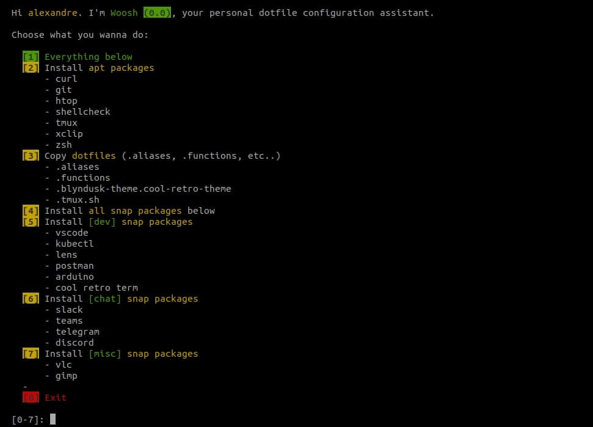
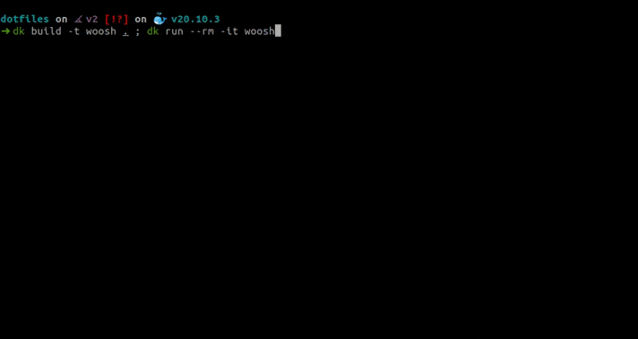

# @blyndusk's dotfiles


## I - Install

```bash
git clone https://github.com/blyndusk/dotfiles.git
chmod +x woo.sh
```



## II - Use

```bash
bash woo.sh
```



- 1 - Do everything in the list below
- 2 - Install `apt packages` like `curl`, `git`, `htop`, etc
- 3 - Copy dotfiles like `.aliases`, `.functions`, etc
- 0 - Exit script

## III - Test

```bash
docker build -t woosh . ; docker run --rm -it woosh
```

## III - License

Under [MIT](https://github.com/blyndusk/dotfiles/blob/master/LICENSE) license.
